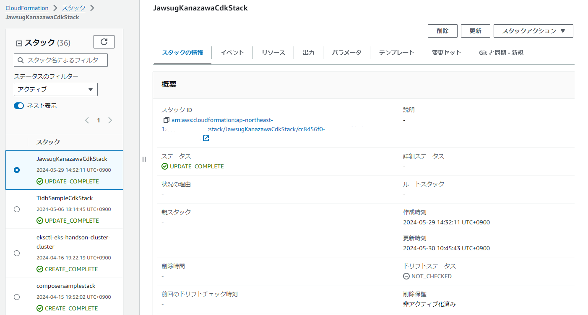
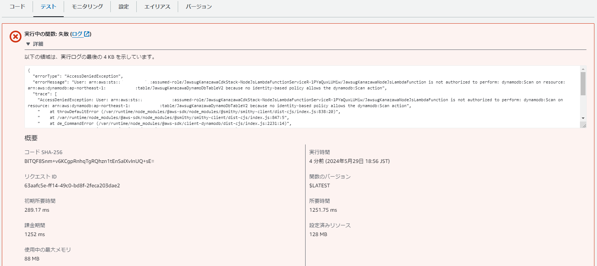
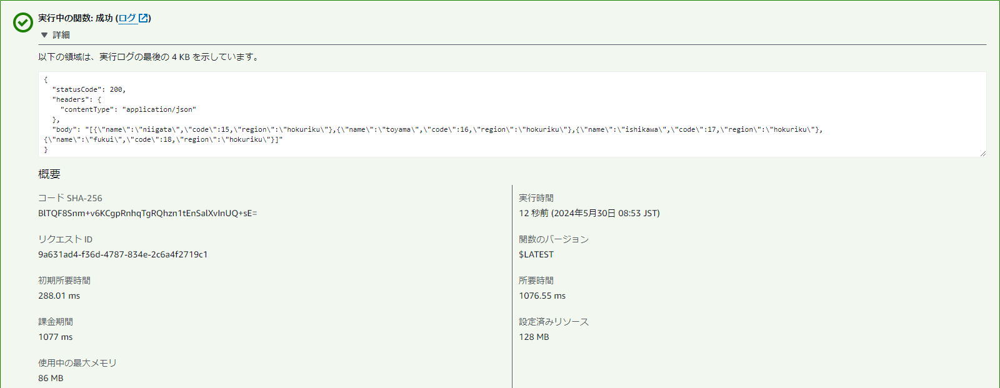
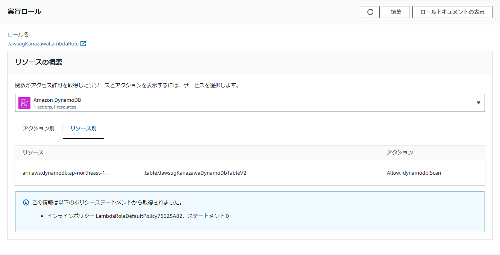
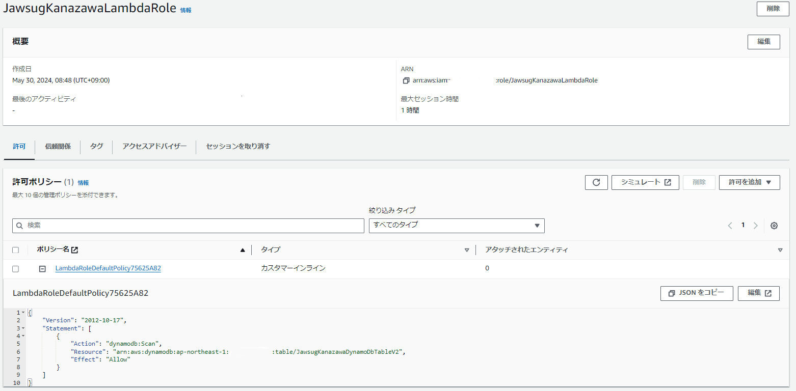
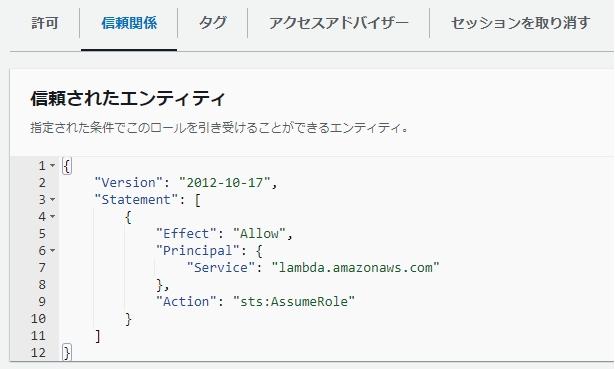

# 20240608-jawsug-kanazawa-cdk-workshop  
  
## はじめに  
このドキュメントは2024/06/08(土) 開催の「[JAWS-UG金沢 #99 CDKワークショップやってみよう](https://jawsug-kanazawa.doorkeeper.jp/events/172615)」のワークショップ作業の手順書になります。  
  
## 参考資料  
  
- [AWS CDKの開始方法(AWS公式ドキュメント)](https://docs.aws.amazon.com/ja_jp/cdk/v2/guide/getting_started.html)
- [AWS CDKを始めるハンズオン ─ IaCの第一歩をAWS LambdaDynamoDBのシンプルな仕組みで学ぶ(AWS ゆっきーさんのブログ)](https://en-ambi.com/itcontents/entry/2023/04/27/093000/)  

## 注意事項  
### Tipsについて
各項目について「Tips」として参考情報（知っているとちょっと役に立つ情報）を記載しています。  
ただしこのワークショップにおいて必須...という訳でもないので、「ワークショップをどんどん進めていきたい」という方は読み飛ばしてしまって構いません。（時間があったらちょっと読む...くらいでOK）  
  
### Hotswap デプロイについて  
AWS CDKのデプロイ(```cdk deploy```)では、オプションで ```hotswap``` または ```hotswap-fallback``` を指定することができます。  
  
```sh
npx cdk deploy --hotswap
npx cdk deploy --hotswap-fallback
```

これらを指定すると、デプロイ時にCloudFormationを使用せず（=CloudFormationの変更セットを作成せず）、AWS CDKがAWSリソースを直接更新するため、通常よりもデプロイを高速に実施することができます。  
  
ただし本ワークショップでは下記の理由により、Hotswap デプロイは使用していません。  
  
- デプロイにそこまで時間がかからない
- Hotswap デプロイに対応していないリソースも多い
  - 例えば、API GatewayはHotswap デプロイ未対応です。
- 万が一何かあった際に手間がかかる＆面倒である
- あくまでもAWS CDKに初めて触れる方を対象としたワークショップである  
  
が、上記を理解した上で「それでも早くデプロイしたい」という方は、Hotswap デプロイを使用して頂いて構いません。  
  
ちなみに```hotswap``` と ```hotswap-fallback``` の違いは、Hotswap デプロイに未対応のリソースがあった場合の挙動です。（前者はそのリソースは無視する、後者は通常のデプロイに切り替えてそのリソースのデプロイを続行する）
  
なおこのHotswap デプロイは、あくまでも開発時にデプロイを高速に実施するための機能です。**本番環境では絶対に使用しないでください！** （CloudFormationのドリフト(=CloudFormationテンプレートと実際のリソースの状態の差分）が発生しまくるので）
## 目次  
  
1. 事前準備  
1. 今回作成する構成
1. AWS CDKプロジェクトの作成+α  
1. AWS Lambdaの作成  
1. AWSにデプロイする
1. DynamoDBテーブルの作成  
1. IAMポリシー＆ロールの作成  
1. GrantXXX メソッドの利用
1. API Gatewayの作成
1. 後片付け
  
## 事前準備  
今回のCDKワークショップでは、下記が必要になります。  
  
- AWS CDK v2
- AWS CLI v2
- Node.js
- REST API リクエストツール
  
### AWS CDK v2 および AWS CLI v2について
AWS CDK v2およびAWS CLI v2については、下記AWS公式ドキュメントを参考にインストールしてください。（分からない点があれば聞いてください）

- [AWS CDKの開始方法](https://docs.aws.amazon.com/ja_jp/cdk/v2/guide/getting_started.html)
- [AWS CLI の開始方法](https://docs.aws.amazon.com/ja_jp/cli/latest/userguide/cli-chap-getting-started.html)
  
※「AWS CDKの開始方法」は日本語だとかなり前衛的(意味深)な文章なので、英語の方が読みやすいかも...
  
#### TypeScriptについて
上記公式ドキュメントでは ```npm -g install typescript``` コマンドでTypeScriptをグルーバルインストールしていますが、本ワークショップではグルーバルインストールは不要です。(```npm install``` でローカルインストールする)

#### 認証情報について
上記公式ドキュメントでは、認証方法について AWS IAM Identity Center の使用が推奨されていますが、本ワークショップではIAMユーザーのクレデンシャル情報(アクセスキー＆シークレットアクセスキー）を使用します。（クレデンシャル情報の作成方法が分からない方がいたら教えてください） 
  
クレデンシャル情報をローカルPCで使用する方法ですが、下記リンク先の「AWS CLIコマンドを使用した設定」の「Long-term credentials」タブを参考にAWS CLIの認証情報を作成してください。
  
[AWS CLI の開始方法 - 新しい設定と認証情報のセットアップ](https://docs.aws.amazon.com/ja_jp/cli/latest/userguide/getting-started-quickstart.html#getting-started-quickstart-new)
  
#### ブートストラップについて
AWS CDKの利用前に「ブートストラップ」と呼ばれる、AWS CDK専用のリソースを作成する作業が1度だけ必要になります。(すでに実施済の場合、この作業は不要です)  
  
ブートストラップは、以下のコマンドで実施できます。  

```sh
## ブートストラップのコマンド
npx cdk bootstrap aws://<アカウント番号>/<リージョン>
  
## 例えばアカウント番号123456789012, 東京リージョン(ap-northeast-1)でブートストラップを実施する場合、下記コマンドを実行する
npx cdk bootstrap aws://123456789012/ap-northeast-1
  
## デフォルト(default)以外のAWS CLIクレデンシャル情報を使用したい場合、下記のようにprofileオプション＆プロファイル名を指定する
## これは他のcdkコマンドでも共通。（以後、この説明は省略します）
npx cdk bootstrap aws://123456789012/ap-northeast-1 --profile my-profile-name
```
    
ブートストラップの補足事項は、下記の通りです  
  
- ブートストラップはリージョン単位で実施が必要です。  
  - 例えば「東京リージョンでは実施済だが、大阪リージョンでは未実施」の場合、大阪リージョンでAWS CDKを使用する際は事前にブートストラップを実施する必要があります。
- ブートストラップで作成されるAWS CDK専用のリソースとして、S3バケットやAmazon ECRなどがあります
    
### Node.js について  
自分のPCにNode.jsがインストールされていない場合、[Node.js公式サイト](https://nodejs.org/en/download/package-manager) を参考に、v20のLTSバージョンのインストールを行ってください。（すでにNode.jsをインストール済みの場合、よほどバージョンが古くない限りは新たにインストールする必要はありません。とりあえずv16で正常動作するのは確認済）

### 使用するプログラム言語について  
今回のワークショップでは、プログラム言語はTypeScriptを使用します。  
AWS CDKを使用する場合、プログラム言語はTypeScriptを使用する事が多いです。(AWS CDK自体がTypeScriptで実装されているため)  
  
ちなみに、AWS CDKは下記のプログラム言語をサポートしています。
  
- TypeScript
- JavaScript
- Python
- Java
- C#
- Go
  
なお、どのプログラム言語を使用する場合でも（TypeScriptやJavaScript以外を使用する場合でも）、**Node.jsのインストールは必須です**。

## 今回作成する構成  
今回最終的に作成する構成は、下図の通りです。（サーバーレスでよくある、REST APIの構成になります）  
  

  

## AWS CDKプロジェクトの作成+α    
まず初めに、AWS CDKプロジェクトを作成します。  
ターミナルで以下のコマンドを実行してください。(わざわざ専用フォルダを作成するのは、空のフォルダじゃないと ```cdk init``` が実行できないからです)
  
```sh
mkdir jawsug-kanazawa-cdk
cd jawsug-kanazawa-cdk
npx cdk init app --language typescript
```
  
すると下記の確認メッセージが表示されると思うので、「y」を押してプロジェクト作成を実施してください。色々処理が実行されます。  
最終的に「All done!」という表示がされればOKです。    

```sh
Need to install the following packages:
cdk@2.143.0
Ok to proceed? (y) 
```

すると、```jawsug-kanazawa-cdk``` フォルダ以下に下記ファイル＆フォルダが作成されると思います。

```sh
jawsug-kanazawa-cdk
├── README.md
├── bin
│   └── jawsug-kanazawa-cdk.ts
├── cdk.json
├── jest.config.js
├── lib
│   ├── jawsug-kanazawa-cdk-stack.ts
│   └── lambda.ts
├── package-lock.json
├── package.json
├── test
│   └── jawsug-kanazawa-cdk.test.ts
└── tsconfig.json
```
  
そうしたら、ターミナルで下記コマンドを実施し、追加で必要なnpmモジュールを```devDependencies```としてインストールします。  
  
```sh 
npm i -D @aws-sdk/client-dynamodb @aws-sdk/lib-dynamodb @types/aws-lambda esbuild
```

最後に、```example/jawsug-kanazawa-cdk/lib/lambda.ts``` ファイルを ```lib``` フォルダにコピーします。  
```sh 
cp example/jawsug-kanazawa-cdk/lib/lambda.ts ./lib
```
  
では、次からは実際にAWS CDKでリソースを作成します。  
  
なおこれ以降の手順は「```jawsug-kanazawa-cdk``` フォルダがカレントディレクトリである」という前提で記載します。
  
## AWS Lambdaの作成
まず一番初めに、AWS Lambdaを作成します。  
  
```lib/jawsug-kanazawa-cdk-stack.ts``` ファイルを開くと、下記のようなソースコードが書かれていると思います。  
「The code that defines your stack goes here(訳：スタックを定義するコードはここに書く)」とある通り、CloudFormationスタックに作成するリソースは、基本的このファイルに定義します。  
今回もここにAWS Lambdaの定義を記載します。  

```typescript
import * as cdk from 'aws-cdk-lib';
import { Construct } from 'constructs';
// import * as sqs from 'aws-cdk-lib/aws-sqs';

export class JawsugKanazawaCdkStack extends cdk.Stack {
  constructor(scope: Construct, id: string, props?: cdk.StackProps) {
    super(scope, id, props);

    // The code that defines your stack goes here

    // example resource
    // const queue = new sqs.Queue(this, 'CdkQueue', {
    //   visibilityTimeout: cdk.Duration.seconds(300)
    // });
  }
}
```
  
ちなみに、「JawsugKanazawaCdkStack(=スタック情報)はどこから参照されているか」ですが、```bin/jawsug-kanazawa-cdk.ts``` に下記コードがあり、ここで「このプロジェクトで作成するスタック」として参照されています。  

```typescript
#!/usr/bin/env node
import 'source-map-support/register';
import * as cdk from 'aws-cdk-lib';
import { JawsugKanazawaCdkStack } from '../lib/jawsug-kanazawa-cdk-stack';

const app = new cdk.App();
new JawsugKanazawaCdkStack(app, 'JawsugKanazawaCdkStack', {
  // コメントは省略
});
```

では、 ```lib/jawsug-kanazawa-cdk-stack.ts``` ファイルにAWS Lambdaの定義を記載します。  
```lib/jawsug-kanazawa-cdk-stack.ts``` に、下記のコードを追記してください。 

```typescript
import * as cdk from 'aws-cdk-lib';
import { Construct } from 'constructs';
+ import { Runtime } from "aws-cdk-lib/aws-lambda";
+ import { NodejsFunction } from "aws-cdk-lib/aws-lambda-nodejs";

export class JawsUgKanazawaCdkStack extends cdk.Stack {
  constructor(scope: Construct, id: string, props?: cdk.StackProps) {
    super(scope, id, props);
    
+    const lambdaFunc = new NodejsFunction(this, "NodeJsLambdaFunction", {
+      entry: './lib/lambda.ts',
+      runtime: Runtime.NODEJS_20_X,
+      handler: 'handler',
+      functionName: 'JawsugKanazawaNodeJsLambdaFunction',
+    });
+     // スタックを削除した際、このLambda関数も削除する
+    lambdaFunc.applyRemovalPolicy(cdk.RemovalPolicy.DESTROY);
  }
}

```
  
### AWSにデプロイする  
では、AWS Lambdaの定義を作成したので、さっそくAWSにデプロイします。  
  
```cdk deploy``` コマンドを実行することで、AWSにデプロイを行うことができます。  
  
```sh
npx cdk deploy
```
  
上記コマンドを実施すると、下図のように変更点＆デプロイしてよいかの確認メッセージが表示されます。  
「y」を入力して、デプロイを進めましょう。  
  

  
下記のようなメッセージが表示されれば、デプロイ成功です。  

```sh
 ✅  JawsugKanazawaCdkStack

✨  Deployment time: 37.96s
```
  
### AWSマネジメントコンソールで確認する  
では、AWSマネジメントコンソールにログインし、実際にLambda関数が作成されていることを確認しましょう。  
  
まずはAWSマネジメントコンソールの「CloudFormation」ページで「スタック」を表示してみてください。  
「JawsugKanazawaCdkStack」という名前のスタックが作成されているはずです。  
  
またスタック名をクリックすることで、スタックの詳細情報が表示されると思います。  
  


次にLambdaページを表示すると、「関数」に先程定義した「JawsugKanazawaNodeJsLambdaFunction」関数が作成されているはずです。    
  
関数名をクリックし、「テスト」タブからテストを実行すると、実際にLambda関数が実行することも確認できます。（現時点では下図のように ```errorType: ValidationException``` エラーが出ますが、これは想定通りの挙動ですので、問題ありません）  
  

  
### AWS CDKの定義の基本  
先程Lambda関数を作成する際に、```JawsUgKanazawaCdkStack```クラス(便宜上、ここでは「Stackクラス」と記載します)内で```NodejsFunction```クラスのコンストラクタを実行して、Lambda関数を作成しました。  
  
実はAWS CDKでのリソース作成は、ほとんどがこの「**Stackクラス内で、リソースクラスのコンストラクタを実行する**」だけです。(ごく一部に例外はありますが、基本的にはほぼすべてのリソースに当てはまります)  
  
またリソースクラスのコンストラクタは、ほぼすべて以下の形式になっています。
  
> new コンストラクタ(スコープ、リソースID、props?)  
  
コンストラクタ引数についての説明は、以下の通りです  
  
|引数|説明|備考|
|:--|:--|:--|
|スコープ|そのリソースの親要素を指定する。（たいていの場合、そのリソースが存在するスタックを指定する）|クロススタック等、よほど特別なことをしない限りは ```this```(=そのリソースが定義されているスタック自身)でOK|
|リソースID|スコープ(≒スタック)内でのリソースの一意のID|同一スコープ内でのリソースIDの重複はNG|
|props|「プロパティ名: プロパティ値」の組で構成されるオブジェクト|AWS Lambdaの ```runtime``` や ```entry``` など、リソースの設定を行うのに使用される|

### AWS CDK Reference Documentation について  
先述の通り、AWS CDKでのリソース定義は「Stackクラス内で、リソースクラスのコンストラクタを実行する」のですが、実際に自分でそれを定義すると、  
  
- 〇〇のリソースを作成したいけど、コンストラクタ名が分からない
- propsに設定可能なプロパティや値が分からない
- そもそも、どのファイルをimportすればいいの？
  
といった疑問が生じると思います。
  
そういう際、ぜひ参照してほしいのが [AWS CDK Reference Documentation](https://docs.aws.amazon.com/cdk/api/v2/docs/aws-construct-library.html) です。  
  
ここにはAWS CDKで定義可能なリソースやプロパティ等について非常に詳しく書かれており、またユースケース毎のプロパティ設定方法がOverviewページでドキュメント化されているので、AWS CDKを使用する際に非常に有用です。  
  
というかAWS CDKを使用する場合、たいていは「**AWS CDKのコードとAWS CDK Reference Documentationを交互ににらめっこしながら作業する**」ということになるので、このページはぜひチェックする癖をつけておいて下さい。(それくらい有用なページです)  
  
#### Tips: Lambda関数のパス  
```NodejsFunction``` の ```entry``` で指定したLambda関数のファイルのパスですが、これは相対パスで指定した場合「**```npx cdk deploy``` コマンドを実施した際のカレントフォルダからの相対パス**」になります。(「```NodejsFunction``` コンストラクタを定義したファイルからの相対パス」**ではありません**)  
  
基本的に```npx cdk deploy``` コマンドはプロジェクトフォルダ直下(=```cdk.json```が存在するフォルダ)で実施する事が多いので(=そうじゃないとエラーになる)、これを知っていないとデプロイ時に「『entryで指定されたLambdaファイルが存在しない』エラーでデプロイができない」ということが起こるので注意しましょう。  
  
そういう混乱を回避したい場合、Node.jsのpathモジュールを使い、```entry``` を下記のように定義します。(下記コードを適用する場合、```tsconfig.json``` の ```compilerOptions``` に```esModuleInterop:true``` の設定を追加する必要があります。)  
  
```typescript
import * as cdk from 'aws-cdk-lib';
import { Construct } from 'constructs';
import { Runtime } from "aws-cdk-lib/aws-lambda";
import { NodejsFunction } from "aws-cdk-lib/aws-lambda-nodejs";

// Node.jsのpathモジュールを使用する
import path from 'path';

export class JawsUgKanazawaCdkStack extends cdk.Stack {
  constructor(scope: Construct, id: string, props?: cdk.StackProps) {
    super(scope, id, props);
    
    const lambdafunc = new NodejsFunction(this, "NodeJsLambdaFunction", {
      // path.resolve(__dirname)でこのファイルが存在するフォルダの
      // 絶対パスを取得後、Lambdaファイルを参照する
      entry: path.resolve(__dirname, 'lambda.ts'),,
      runtime: Runtime.NODEJS_20_X,
      handler: 'handler',
    });
  }
}
```

#### Tips: NodejsFunctionを使う理由
今回、Lambda関数の定義に```aws-cdk-lib/aws-lambda-nodejs```の```NodejsFunction```を使用しました。  
ただ、これ以外に ```aws-cdk-lib/aws-lambda```の```Function```を使用する方法でもLambda関数を定義できます。(むしろこちらの方が一般的)  
  
ただしLambda関数をTypeScriptで記載している場合、```NodejsFunction```を使用すると「バンドル＆トランスパイル処理をAWS CDK側で自動で実施してくれる」という利点があるので、Lambda関数をTypeScriptで記載する場合は、```NodejsFunction``` を活用すると良いと思います。(```Function``` にそのような機能はありません。またAWS Lambda関数自体はTypeScriptのままでは実行できません。)  
  
逆にそうではない場合や「バンドル＆トランスパイル処理をカスタマイズしたい」など、何かの理由であえてバンドル＆トランスパイル処理を手動で実施したい場合は、```Function```を使用してください。  
  
ちなみに、```NodejsFunction``` でバンドル＆トランスパイル処理を実施する際、esbuildがインストールされている場合はesbuildが、そうではない場合はDockerが使用されます。  
esbuildの方がDockerよりも用意が簡単なため、今回のワークショップではesbuildを使用しています。(最初にesbuildを```npm i -D``` したのはそのため)
  
  
## DynamoDBテーブルの作成
では、次にDynamoDBテーブルを作成して、LambdaからDynamoDBテーブルのデータ取得を行えるようにします。  
```lib/jawsug-kanazawa-cdk-stack.ts``` に、下記のコードを追加してください。 

```typescript
import * as cdk from 'aws-cdk-lib';
import { Construct } from 'constructs';
import { Runtime } from "aws-cdk-lib/aws-lambda";
import { NodejsFunction } from "aws-cdk-lib/aws-lambda-nodejs";
+ import { TableV2, AttributeType } from "aws-cdk-lib/aws-dynamodb";

export class JawsugKanazawaCdkStack extends cdk.Stack {
  constructor(scope: Construct, id: string, props?: cdk.StackProps) {
    super(scope, id, props);
    
+    const dynamoDbTable = new TableV2(this, 'DynamoDbTableV2', {
+      tableName: 'JawsugKanazawaDynamoDbTableV2',
+      partitionKey: {
+        name: 'region',
+        type: AttributeType.STRING
+      },
+      sortKey: {
+        name: 'code',
+        type: AttributeType.NUMBER
+      },
+      removalPolicy: cdk.RemovalPolicy.DESTROY,
+    });
    
    const lambdaFunc = new NodejsFunction(this, "NodeJsLambdaFunction", {
      entry: './lib/lambda.ts',
      runtime: Runtime.NODEJS_20_X,
      handler: 'handler',
      functionName: 'JawsugKanazawaNodeJsLambdaFunction',
+      environment: {
+        TABLE_NAME: dynamoDbTable.tableName,
+      },
    });
    lambdaFunc.applyRemovalPolicy(cdk.RemovalPolicy.DESTROY);
  }
}

```
  
その後 ```npx cdk deploy``` コマンドで再度デプロイを実施すると、「JawsugKanazawaDynamoDbTableV2」という名前のDynamoDBテーブルが作成されますので、AWSマネジメントコンソールの「テーブル」で確認してください。  
  
また、この「JawsugKanazawaDynamoDbTableV2」テーブルについて、「項目を探索 - 項目を作成」から下記4項目を追加してください。(「name」は「新しい属性の追加 - 文字列」で追加してください)  
  
|region|code|name|
|:--|:--|:--|
|hokuriku|15|niigata|
|hokuriku|16|toyama|
|hokuriku|17|toyama|
|hokuriku|18|fukui|
  

  
### Lambda関数の再実行  
「JawsugKanazawaDynamoDbTableV2」テーブル作成後、再度「JawsugKanazawaNodeJsLambdaFunction」のテストを実行してください。    
今度は下図のように ```errorType: AccessDeniedException``` のエラーが発生すると思います。(このエラーも想定通りなので、問題ありません)  

  
  
ただ「AccessDenied(=アクセスが拒否される)」ということは、少なくともJawsugKanazawaNodeJsLambdaFunction関数からJawsugKanazawaDynamoDbTableV2テーブルへのアクセスは実施されているということなので、JawsugKanazawaDynamoDbTableV2テーブルの挙動も問題なさそうです。
  
#### Tips: 別リソースのプロパティを参照する＆そのメリット  
TODO：書く
  
## IAMポリシー＆ロールの作成
先程の ```AccessDeniedException``` エラーは、JawsugKanazawaNodeJsLambdaFunction関数にJawsugKanazawaDynamoDbTableV2テーブルへのアクセス許可ポリシーを持つIAMロールが付与されていないことが原因です。  
なので、次はそのアクセス権限を付与するため、IAMポリシー＆ロールをAWS CDKで作成します。  
  
なお、実際にはもっと簡単にアクセス権限を付与する方法もありますが（次の「GrantXXX メソッドの利用」で説明します）、IAMポリシーはAWSのセキュリティにおける基本、かつ非常に重要な要素なので、今回は最初に手作業で定義してみます。  
  
```lib/jawsug-kanazawa-cdk-stack.ts``` に、下記のコードを追加して、```npx cdk deploy``` コマンドでデプロイを実行してください。

```typescript
import * as cdk from 'aws-cdk-lib';
import { Construct } from 'constructs';
import { Runtime } from "aws-cdk-lib/aws-lambda";
import { NodejsFunction } from "aws-cdk-lib/aws-lambda-nodejs";
import { TableV2, AttributeType } from "aws-cdk-lib/aws-dynamodb";
+ import { Role, Effect, ServicePrincipal, PolicyStatement } from "aws-cdk-lib/aws-iam";

export class JawsugKanazawaCdkStack extends cdk.Stack {
  constructor(scope: Construct, id: string, props?: cdk.StackProps) {
    super(scope, id, props);
    
    const dynamoDbTable = new TableV2(this, 'DynamoDbTableV2', {
      tableName: 'JawsugKanazawaDynamoDbTableV2',
      partitionKey: {
        name: 'region',
        type: AttributeType.STRING
      },
      sortKey: {
        name: 'code',
        type: AttributeType.NUMBER
      },
      removalPolicy: cdk.RemovalPolicy.DESTROY,
    });

+   const role = new Role(this, 'LambdaRole', {
+     assumedBy: new ServicePrincipal('lambda.amazonaws.com'),
+     roleName: 'JawsugKanazawaLambdaRole',
+   });
+    
+   role.addToPrincipalPolicy(new PolicyStatement({
+     actions: ['dynamodb:Scan'],
+     effect: Effect.ALLOW,
+     resources: [dynamoDbTable.tableArn],
+   }));
    
    const lambdaFunc = new NodejsFunction(this, "NodeJsLambdaFunction", {
      entry: './lib/lambda.ts',
      runtime: Runtime.NODEJS_20_X,
      handler: 'handler',
      functionName: 'JawsugKanazawaNodeJsLambdaFunction',
      environment: {
        TABLE_NAME: dynamoDbTable.tableName,
      },
+     role,
    });
    lambdaFunc.applyRemovalPolicy(cdk.RemovalPolicy.DESTROY);
  }
}

```
  
### Lambda関数の再実行  
デプロイ後、再度「JawsugKanazawaNodeJsLambdaFunction」のテストを実行してください。   
今度は下図のようにテスト実行が正常終了し、```body``` に「DynamoDBテーブルの作成」で登録した値が格納されていると思います。  
   
  
  
また「『設定』タブ - アクセス権限」を確認すると、JawsugKanazawaDynamoDbTableV2テーブルに対するScan(=全データ取得)が許可されていることが分かります。    
  
  
  
そして「ロール名」に表示されている「JawsugKanazawaLambdaRole」をクリックすると、IAMページに移動します。  
そこで先程定義したIAMロール「JawsugKanazawaLambdaRole」およびそのポリシーが正しく作成されていることが確認できます。  
  
また「信頼関係」タブを表示すると、Lambdaに対してsts:AssumeRoleが許可されていることも確認できます。  
    
  
  

### ロールにポリシーを付与する方法
TODO: ロールにポリシーをアタッチする方法について書く
  
  
#### Tips: 何でAWS SDKがdevDependenciesなのにLambda関数が正常に動くの？
TODO: あとで書く  
  
## GrantXXX メソッドの利用  
先程の「IAMポリシー＆ロールの作成」で、IAMポリシー＆ロールを作成してアクセス権限を付与しました。  
しかし、実際に全リソースに対しIAMポリシー＆ロールを作成するとなると非常に手間がかかりますし、管理も大変です。  
  
しかしAWS CDKでは、アクセス権限を簡単に付与するための「gran」から始まるメソッドが初めから用意されており(便宜上「GrantXXXメソッド」と記載します)、アクセス権限の設定が非常にシンプルに実施できます。    
  
今回はこの「GrantXXXメソッド」にてアクセス権限の設定を行います。  
  
### アクセス権限の削除＆GrantXXX メソッドの利用  
まずは ```lib/jawsug-kanazawa-cdk-stack.ts``` から、先程の「IAMポリシー＆ロールの作成」で追加したコードを全て削除（あるいはコメントアウト）して、 ```npx cdk deploy``` コマンドでデプロイを実施してください。  
  
デプロイが完了したら再度「JawsugKanazawaNodeJsLambdaFunction」のテストを実行して、```errorType: AccessDeniedException``` のエラーが再度発生する事を確認してください。（「『設定』タブ - アクセス権限」の表示内容も変わっています。）  
  
上記を確認したら、```lib/jawsug-kanazawa-cdk-stack.ts``` において、```JawsugKanazawaCdkStack``` クラスのコンストラクタの末尾に ```dynamoDbTable.grantReadData()``` メソッドを追加します。(下記コードを参照)  
  
```typescript
// import文は省略
export class JawsugKanazawaCdkStack extends cdk.Stack {
  constructor(scope: Construct, id: string, props?: cdk.StackProps) {
    super(scope, id, props);
    
    // ...(中略)
    lambdaFunc.applyRemovalPolicy(cdk.RemovalPolicy.DESTROY);
    
    // この1行を追加する
+   dynamoDbTable.grantReadData(lambdaFunc);
  }
}
```
  
その後、 再度 ```npx cdk deploy``` コマンドでのデプロイ、および「JawsugKanazawaNodeJsLambdaFunction」のテストを実行します。  
今度はテスト実行が正常終了し、「IAMポリシー＆ロールの作成」と同様 ```body``` に「DynamoDBテーブルの作成」で登録した値が格納されていると思います。 
  
また「ロール名」に表示されているロールをクリックしてIAMページに移動すると、そのロールの「許可ポリシー」にJawsugKanazawaDynamoDbTableV2テーブルへのアクセス許可ポリシー(読み取り専用ポリシー)が付与されていることが分かります。  
  
つまり、**```dynamoDbTable.grantReadData(lambdaFunc)``` の1行だけで、アクセス権限の付与が行える**わけです。便利！  
  
ちなみに、「JawsugKanazawaNodeJsLambdaFunction」のテストで相変わらず ```errorType: AccessDeniedException``` のエラーが発生する場合、再度デプロイを行ってみてください。  
またその際「IAM Statement Change」に下記の表示がされているかを確認してください。(下記の表示がされているなら、そのデプロイを実行すればテストは正常終了するはずです)   
  
  
  
### GrantXXXメソッドについて
TODO: Grant系メソッドの使用について書く


## API Gatewayの作成
ここまででLambda⇔DynamoDB間のデータのやり取りが正常に出来ることを確認しました。  
が、実際の環境ではこのような処理をREST APIのリクエストをトリガに行うことが多いので(いわゆる「イベントドリブン」)、最後にAPI Gatewayを作成して、REST APIのリクエストをトリガに実施するようにしましょう。
  
```lib/jawsug-kanazawa-cdk-stack.ts``` に、下記のコードを追加して、再度 ```npx cdk deploy``` コマンドでデプロイを実行してください。  
  
```typescript
import * as cdk from 'aws-cdk-lib';
import { Construct } from 'constructs';
import { Runtime } from "aws-cdk-lib/aws-lambda";
import { NodejsFunction } from "aws-cdk-lib/aws-lambda-nodejs";
import { TableV2, AttributeType } from "aws-cdk-lib/aws-dynamodb";
+ import { RestApi, LambdaIntegration } from "aws-cdk-lib/aws-apigateway";

export class JawsugKanazawaCdkStack extends cdk.Stack {
  constructor(scope: Construct, id: string, props?: cdk.StackProps) {
    super(scope, id, props);
    
    // ...(中略)
    
    dynamoDbTable.grantReadData(lambdaFunc);
    
+   const apiGw = new RestApi(this, 'ApiGatewayRestApi', {
+     restApiName: 'JawsugKanazawaRestApi',
+     deployOptions: {
        // stageNameは省略した場合「prod」になります。
+       stageName: 'test'
+     }
+   });
+
+   const apiGwResource = apiGw.root.addResource('jawsug');
+   apiGwResource.addMethod('GET', new LambdaIntegration(lambdaFunc));
  }
}
```

### API Gateway及びREST APIリクエストの確認
デプロイが完了したら、AWSマネジメントコンソールの「API Gateway」ページを表示してください。  
「API」に先程作成した「JawsugKanazawaRestApi」が作成されていると思います。  
  
また「JawsugKanazawaRestApi」の「リソース - /jawsug - GET」を確認すると「JawsugKanazawaNodeJsLambdaFunction」が実行されることが、そして「ステージ - test - / - /jawsug - GET」を確認すると、REST APIリクエスト用のURLが確認できます。  
  
  
  
  
上記を確認したら、実際にREST APIリクエスト用のURLにリクエストを送信してください。（リクエストツールは何でもよいです。curl でもOKです)  
  
問題なければ、ステータスが「200 OK」で、```body``` に「DynamoDBテーブルの作成」で登録した値が格納されたレスポンスが返ってくると思います。(下図はVS Code拡張機能「Postman」で確認)

  
  
ここまでで、今回のワークショップの作業は一通り完了です。お疲れさまでした。  
もし時間があったら、ぜひ自分で色々試してみてください。(例えば下記)  
  
- S3やSQSなど、他のリソースを追加する
- JawsugKanazawaDynamoDbTableV2テーブルへのデータの書き込みを許可する
- JawsugKanazawaRestApiに対し、リソースポリシーを設定する
  - 自分しか各種Lambda関数の実行を許可しない...など  
  
この後、「もう今回のワークショップは必要ない」という方は、下記の「後片付け」で作成したリソースの削除を行ってください。  
「後で参照したいから残しておきたい」という方は、そのままで構いません。(課金に関しては自己責任でお願いします。ただし今回のワークショップで作成したリソースは、よほど実行回数が多くない限り、課金は発生しないはずです)  
  
## 後片付け
では、最後に作成したリソースを全て削除します。  
リソースを削除するは、下記の```cdk destroy```コマンドを実施します  

```sh
npx cdk destroy
```
  
すると下記の確認メッセージが表示されるので、削除対象のスタック名が「JawsugKanazawaCdkStack」であることを確認して、「y」を押して削除を実行してください。  
> Are you sure you want to delete: JawsugKanazawaCdkStack (y/n)?  
  
下記のメッセージが表示されれば、削除成功です。  

```sh
JawsugKanazawaCdkStack: destroying... [1/1]

 ✅  JawsugKanazawaCdkStack: destroyed
```
  
あとはAWSマネジメントコンソールで、今回作成したリソースがないことを確認してください。   
  
- CloudFormationスタック(JawsugKanazawaCdkStack)
- Lambda関数(JawsugKanazawaNodeJsLambdaFunction)
- DynamoDBテーブル(JawsugKanazawaDynamoDbTableV2)
- API Gateway(JawsugKanazawaRestApi)
- IAMロール&IAMポリシー(「Kanazawa」で検索して出てこなければOK)  
   
これで後片付けも終了です。お疲れさまでした。  
  
※ 「事前準備」においてIAMユーザーやAWS CLIの認証情報などを手作業で作成した場合は、必要に応じて手作業で削除を行ってください。
  
