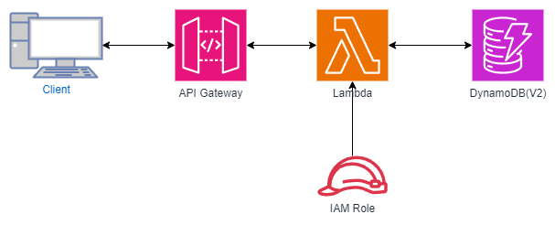
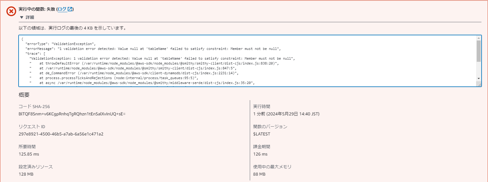

# 20240608-jawsug-kanazawa-cdk-workshop  
  
## はじめに  
このドキュメントは2024/06/08(土) 開催の「[JAWS-UG金沢 #99 CDKワークショップやってみよう](https://jawsug-kanazawa.doorkeeper.jp/events/172615)」の手順書になります。  
  
## 参考資料  
  
- [AWS CDKの開始方法(AWS公式ドキュメント)](https://docs.aws.amazon.com/ja_jp/cdk/v2/guide/getting_started.html)
- [AWS CDKを始めるハンズオン ─ IaCの第一歩をAWS LambdaDynamoDBのシンプルな仕組みで学ぶ(AWS ゆっきーさんのブログ)](https://en-ambi.com/itcontents/entry/2023/04/27/093000/)  

## 注意事項  
各項目について「Tips」として参考情報（知っているとちょっと役に立つ情報）を記載しています。  
ただしこのワークショップを実行する際に必須の情報という訳でもないので、「とりあえずワークショップをどんどん進めていきたい」という方は読み飛ばしてしまって構いません。（時間があったらちょっと読む...くらいのスタンスでOK）

## 目次  
  
1. 事前準備  
1. 今回作成する構成
1. AWS CDKプロジェクトの作成+α  
1. AWS Lambdaの作成  
1. AWSにデプロイする
1. DynamoDBテーブルの作成  
1. IAMポリシー＆ロールの作成  
1. IGrantable メソッドの利用
1. API Gatewayの作成
1. 後片付け
  
## 事前準備  
今回のCDKワークショップでは、下記が必要になります。(他にもありますが省略)  
  
- AWS CDK v2
- AWS CLI v2
- Node.js
  
### AWS CDK v2 および AWS CLI v2について
AWS CDK v2およびAWS CLI v2については、下記AWS公式ドキュメントを参考にインストールしてください。(分からない点があれば聞いてください。)

- [AWS CDKの開始方法](https://docs.aws.amazon.com/ja_jp/cdk/v2/guide/getting_started.html)
- [AWS CLI の開始方法](https://docs.aws.amazon.com/ja_jp/cli/latest/userguide/cli-chap-getting-started.html)
  
※「AWS CDKの開始方法」は日本語だとかなり前衛的(意味深)な文章なので、英語表記の方が読みやすいかも...
  
#### TypeScriptについて
上記公式ドキュメントでは ```npm -g install typescript``` コマンドでTypeScriptをグルーバルインストールしていますが、本ワークショップではグルーバルインストールは不要です。(```npm install``` でローカルインストールする)

#### 認証情報について
上記公式ドキュメントでは、認証方法について AWS IAM Identity Center の使用が推奨されていますが、本ワークショップではIAMユーザーのクレデンシャル情報(アクセスキー＆シークレットアクセスキー）を使用します。(IAM ユーザーのクレデンシャル情報の作成方法が分からない方がいたら教えてください)  
  
クレデンシャル情報をローカルPCで使用する方法ですが、下記リンク先の「AWS CLIコマンドを使用した設定」の「Long-term credentials」タブを参考にAWS CLIの認証情報を作成してください
  
[AWS CLI の開始方法 - 新しい設定と認証情報のセットアップ](https://docs.aws.amazon.com/ja_jp/cli/latest/userguide/getting-started-quickstart.html#getting-started-quickstart-new)
  
#### ブートストラップについて
AWS CDKの利用前に「ブートストラップ」と呼ばれる、AWS CDK専用のリソースを作成する作業が1度だけ必要になります。(すでに実施済の場合、この作業は不要です)  
  
ブートストラップは、以下のコマンドで実施できます。  

```sh
## ブートストラップのコマンド
npx cdk bootstrap aws://<アカウント番号>/<リージョン>
  
## 例えばアカウント番号123456789012, 東京リージョン(ap-northeast-1)でブートストラップを実施する場合、下記コマンドを実行する
npx cdk bootstrap aws://123456789012/ap-northeast-1
  
## デフォルト以外のAWS CLIクレデンシャル情報を使用したい場合、下記のようにprofileオプション＆プロファイル名を指定する
## これは他のcdkコマンドでも共通。（以後、この説明は省略します）
npx cdk bootstrap aws://123456789012/ap-northeast-1 --profile my-profile-name
```
    
ブートストラップの補足事項は、下記の通りです  
  
- ブートストラップはリージョン単位で実施が必要です。  
  - 例えば「東京リージョンでは実施済だが、大阪リージョンでは未実施」の場合、大阪リージョンでAWS CDKを使用する際は事前にブートストラップを実施する必要があります。
- ブートストラップで作成されるAWS CDK専用のリソースとして、S3バケットやAmazon ECR等があります
    
### Node.js について  
自分のPCにNode.jsがインストールされていない場合、[Node.js公式サイト](https://nodejs.org/en/download/package-manager) を参考に、v20(LTS)のインストールを行ってください。(インストール済みの場合、よほどバージョンが古くない限りは新たにインストールする必要はありません。とりあえずv16で正常動作するのは確認済)

### プログラム言語について  
今回のワークショップでは、プログラム言語はTypeScriptを使用します。  
AWS CDKを使用する場合、プログラム言語はTypeScriptを使用する事が多いです。(AWS CDK自体がTypeScriptで実装されているため)  
  
ちなみに、AWS CDKは下記のプログラム言語をサポートしています。
  
- TypeScript
- JavaScript
- Python
- Java
- C#
- Go
  
なお、どのプログラム言語を使用する場合でも(TypeScriptやJavaScript以外を使用する場合でも)、**Node.jsのインストールは必須です**。

## 今回作成する構成  
今回最終的に作成する構成は、下図の通りです。(サーバーレスでよくある、RESTful APIの構成になります。)  
  

  

## AWS CDKプロジェクトの作成+α    
まず初めに、AWS CDKプロジェクトを作成します。  
ターミナルで以下のコマンドを実行してください。(わざわざ専用フォルダを作成するのは、空のフォルダじゃないと ```cdk init``` が実行できないからです)
  
```sh
mkdir jawsug-kanazawa-cdk
cd jawsug-kanazawa-cdk
npx cdk init app --language typescript
```
  
すると下記の確認メッセージが表示されると思うので、「y」を押してプロジェクト作成を実施してください。色々処理が実行されます。  
最終的に「All done!」という表示がされればOKです。    

```sh
Need to install the following packages:
cdk@2.143.0
Ok to proceed? (y) 
```

すると、```jawsug-kanazawa-cdk``` フォルダ以下に下記ファイル＆フォルダが作成されると思います。

```sh
jawsug-kanazawa-cdk
├── README.md
├── bin
│   └── jawsug-kanazawa-cdk.ts
├── cdk.json
├── jest.config.js
├── lib
│   ├── jawsug-kanazawa-cdk-stack.ts
│   └── lambda.ts
├── package-lock.json
├── package.json
├── test
│   └── jawsug-kanazawa-cdk.test.ts
└── tsconfig.json
```
  
そうしたら、ターミナルで下記コマンドを実施し、追加で必要なnpmモジュールを```devDependencies```としてインストールします。  
  
```sh 
npm i -D @aws-sdk/client-dynamodb @aws-sdk/lib-dynamodb @types/aws-lambda esbuild
```

最後に、```example/jawsug-kanazawa-cdk/lib/lambda.ts``` ファイルを ```lib``` フォルダにコピーします。  
```sh 
cp example/jawsug-kanazawa-cdk/lib/lambda.ts ./lib
```
  
では、次からは実際にAWS CDKでリソースを作成します。  
  
なおこれ以降の手順は「```jawsug-kanazawa-cdk``` フォルダがカレントディレクトリである」という前提で記載します。
  
## AWS Lambdaの作成
まず一番初めに、AWS Lambdaを作成します。  
  
```lib/jawsug-kanazawa-cdk-stack.ts``` ファイルを開くと、下記のようなソースコードが書かれていると思います。  
「The code that defines your stack goes here(訳：スタックを定義するコードはここに書く)」とある通り、CloudFormationスタックに作成するリソースは、基本的このファイルに定義します。  
今回もここにAWS Lambdaの定義を記載します。  

```typescript
import * as cdk from 'aws-cdk-lib';
import { Construct } from 'constructs';
// import * as sqs from 'aws-cdk-lib/aws-sqs';

export class JawsugKanazawaCdkStack extends cdk.Stack {
  constructor(scope: Construct, id: string, props?: cdk.StackProps) {
    super(scope, id, props);

    // The code that defines your stack goes here

    // example resource
    // const queue = new sqs.Queue(this, 'CdkQueue', {
    //   visibilityTimeout: cdk.Duration.seconds(300)
    // });
  }
}
```
  
ちなみに、「JawsugKanazawaCdkStack(=スタック情報)はどこから参照されているか」ですが、```bin/jawsug-kanazawa-cdk.ts``` に下記コードがあり、ここで「このプロジェクトで作成するスタック」として参照されています。  

```typescript
#!/usr/bin/env node
import 'source-map-support/register';
import * as cdk from 'aws-cdk-lib';
import { JawsugKanazawaCdkStack } from '../lib/jawsug-kanazawa-cdk-stack';

const app = new cdk.App();
new JawsugKanazawaCdkStack(app, 'JawsugKanazawaCdkStack', {
  // コメントは省略
});
```

では、 ```lib/jawsug-kanazawa-cdk-stack.ts``` ファイルにAWS Lambdaの定義を記載します。  
```lib/jawsug-kanazawa-cdk-stack.ts``` に、下記のコードを追記してください。 

```typescript
import * as cdk from 'aws-cdk-lib';
import { Construct } from 'constructs';
+ import { Runtime } from "aws-cdk-lib/aws-lambda";
+ import { NodejsFunction } from "aws-cdk-lib/aws-lambda-nodejs";

export class JawsUgKanazawaCdkStack extends cdk.Stack {
  constructor(scope: Construct, id: string, props?: cdk.StackProps) {
    super(scope, id, props);
    
+    const lambdaFunc = new NodejsFunction(this, "NodeJsLambdaFunction", {
+      entry: './lib/lambda.ts',
+      runtime: Runtime.NODEJS_20_X,
+      handler: 'handler',
+      functionName: 'JawsugKanazawaNodeJsLambdaFunction',
+    });
+     // スタックを削除した際、このLambda関数も削除する
+    lambdaFunc.applyRemovalPolicy(cdk.RemovalPolicy.DESTROY);
  }
}

```
  
### AWSにデプロイする  
では、AWS Lambdaの定義を作成したので、さっそくAWSにデプロイします。  
  
```cdk deploy``` コマンドを実行することで、AWSにデプロイを行うことができます。  
  
```sh
npx cdk deploy
```
  
上記コマンドを実施すると、下図のように変更点＆デプロイしてよいかの確認メッセージが表示されます。  
「y」を入力して、デプロイを進めましょう。  
  

  
下記のようなメッセージが表示されれば、デプロイ成功です。  

```sh
 ✅  JawsugKanazawaCdkStack

✨  Deployment time: 37.96s
```
  
### AWSマネジメントコンソールで確認する  
では、AWSマネジメントコンソールにログインし、実際にLambda関数が作成されていることを確認しましょう。  
AWSマネジメントコンソールのLambda関数ページを確認すると、実際に先程定義したAWS Lambda関数が作成されています。(「JawsugKanazawaNodeJsLambdaFunction」という名前のLambda関数があるはずです)  
  
「テスト」タブからテストを実行すると、実際にLambda関数が動くことも確認できます。（現時点では下図のように「Value null at 'tanleName failed to...'」というエラーメッセージが出ますが、これは想定通りの挙動ですので、問題ありません）  
  

  
### AWS CDKの定義の基本  
先程Lambda関数を作成する際に、```JawsUgKanazawaCdkStack```クラス(便宜上、ここでは「Stackクラス」と記載します)内で```NodejsFunction```クラスのコンストラクタを実行して、Lambda関数を作成しました。  
  
実はAWS CDKでのリソース作成は、ほとんどがこの「**Stackクラス内で、リソースクラスのコンストラクタを実行する**」だけです。(ごく一部に例外はありますが、基本的にはほぼすべてのリソースに当てはまります)  
  
またリソースクラスのコンストラクタは、ほぼすべて以下の形式になっています。
  
> new コンストラクタ(スコープ、リソースID、props?)  
  
コンストラクタ引数についての説明は、以下の通りです  
  
|引数|説明|備考|
|:--|:--|:--|
|スコープ|そのリソースの親要素を指定する。（たいていの場合、そのリソースが存在するスタックを指定する）|クロススタック等、よほど特別なことをしない限りは ```this```(=そのリソースが定義されているスタック自身)でOK|
|リソースID|スコープ(≒スタック)内でのリソースの一意のID|同一スコープ内でのリソースIDの重複はNG|
|props|「プロパティ名: プロパティ値」の組で構成されるオブジェクト|AWS Lambdaの ```runtime``` や ```entry``` など、リソースの設定を行うのに使用される|

### AWS CDK Reference Documentation について  
先述の通り、AWS CDKでのリソース定義は「Stackクラス内で、リソースクラスのコンストラクタを実行する」のですが、実際に自分でそれを定義すると、  
  
- 〇〇のリソースを作成したいけど、コンストラクタ名が分からない
- propsに設定可能なプロパティや値が分からない
- そもそも、どのファイルをimportすればいいの？
  
といった疑問が生じると思います。
  
そういう際、ぜひ参照してほしいのが [AWS CDK Reference Documentation](https://docs.aws.amazon.com/cdk/api/v2/docs/aws-construct-library.html) です。  
  
ここにはAWS CDKで定義可能なリソースやプロパティ等について非常に詳しく書かれており、またユースケース毎のプロパティ設定方法がOverviewページでドキュメント化されているので、AWS CDKを使用する際に非常に有用です。  
  
というかAWS CDKを使用する場合、たいていは「**AWS CDKのコードとAWS CDK Reference Documentationを交互ににらめっこしながら作業する**」ということになるので、このページはぜひチェックする癖をつけておいて下さい。(それくらい有用なページです)  
  
#### Tips: Lambda関数のパス  
```NodejsFunction``` の ```entry``` で指定したLambda関数のファイルのパスですが、これは相対パスで指定した場合「**```npx cdk deploy``` コマンドを実施した際のカレントフォルダからの相対パス**」になります。(「```NodejsFunction``` コンストラクタを定義したファイルからの相対パス」**ではありません**)  
  
基本的に```npx cdk deploy``` コマンドはプロジェクトフォルダ直下(=```cdk.json```が存在するフォルダ)で実施する事が多いので(=そうじゃないとエラーになる)、これを知っていないとデプロイ時に「『entryで指定されたLambdaファイルが存在しない』エラーでデプロイができない」ということが起こるので注意しましょう。  
  
そういう混乱を回避したい場合、Node.jsのpathモジュールを使い、```entry``` を下記のように定義します。(下記コードを適用する場合、```tsconfig.json``` の ```compilerOptions``` に```esModuleInterop:true``` の設定を追加する必要があります。)  
  
```typescript
import * as cdk from 'aws-cdk-lib';
import { Construct } from 'constructs';
import { Runtime } from "aws-cdk-lib/aws-lambda";
import { NodejsFunction } from "aws-cdk-lib/aws-lambda-nodejs";

// Node.jsのpathモジュールを使用する
import path from 'path';

export class JawsUgKanazawaCdkStack extends cdk.Stack {
  constructor(scope: Construct, id: string, props?: cdk.StackProps) {
    super(scope, id, props);
    
    const lambdafunc = new NodejsFunction(this, "NodeJsLambdaFunction", {
      // path.resolve(__dirname)でこのファイルが存在するフォルダの
      // 絶対パスを取得後、Lambdaファイルを参照する
      entry: path.resolve(__dirname, 'lambda.ts'),,
      runtime: Runtime.NODEJS_20_X,
      handler: 'handler',
    });
  }
}
```

#### Tips: NodejsFunctionを使う理由
今回、Lambda関数の定義に```aws-cdk-lib/aws-lambda-nodejs```の```NodejsFunction```を使用しました。  
ただ、これ以外に ```aws-cdk-lib/aws-lambda```の```Function```を使用する方法でもLambda関数を定義できます。(むしろこちらの方が一般的)  
  
ただしLambda関数をTypeScriptで記載している場合、```NodejsFunction```を使用すると「バンドル＆トランスパイル処理をAWS CDK側で自動で実施してくれる」という利点があるので、Lambda関数をTypeScriptで記載する場合は、```NodejsFunction``` を活用すると良いと思います。(```Function``` にそのような機能はありません。またAWS Lambda関数自体はTypeScriptのままでは実行できません。)  
  
逆にそうではない場合や「バンドル＆トランスパイル処理をカスタマイズしたい」など、何かの理由であえてバンドル＆トランスパイル処理を手動で実施したい場合は、```Function```を使用してください。  
  
ちなみに、```NodejsFunction``` でバンドル＆トランスパイル処理を実施する際、esbuildがインストールされている場合はesbuildが、そうではない場合はDockerが使用されます。  
esbuildの方がDockerよりも用意が簡単なため、今回のワークショップではesbuildを使用しています。(最初にesbuildを```npm i -D``` したのはそのため)
  
  
## DynamoDBテーブルの作成
では、次にDynamoDBテーブルを作成して、LambdaからDynamoDBテーブルのデータ取得を行えるようにします。  
```lib/jawsug-kanazawa-cdk-stack.ts``` に、下記のコードを追加してください。 

```typescript
import * as cdk from 'aws-cdk-lib';
import { Construct } from 'constructs';
import { Runtime } from "aws-cdk-lib/aws-lambda";
import { NodejsFunction } from "aws-cdk-lib/aws-lambda-nodejs";
+ import { TableV2, AttributeType } from "aws-cdk-lib/aws-dynamodb";

export class JawsugKanazawaCdkStack extends cdk.Stack {
  constructor(scope: Construct, id: string, props?: cdk.StackProps) {
    super(scope, id, props);
    
+    const dynamoDbTable = new TableV2(this, 'DynamoDbTableV2', {
+      tableName: 'JawsugKanazawaDynamoDbTableV2',
+      partitionKey: {
+        name: 'region',
+        type: AttributeType.STRING
+      },
+      sortKey: {
+        name: 'code',
+        type: AttributeType.NUMBER
+      },
+      removalPolicy: cdk.RemovalPolicy.DESTROY,
+    });
    
    const lambdaFunc = new NodejsFunction(this, "NodeJsLambdaFunction", {
      entry: './lib/lambda.ts',
      runtime: Runtime.NODEJS_20_X,
      handler: 'handler',
      functionName: 'JawsugKanazawaNodeJsLambdaFunction',
+      environment: {
+        TABLE_NAME: dynamoDbTable.tableName,
+      },
    });
    lambdaFunc.applyRemovalPolicy(cdk.RemovalPolicy.DESTROY);
  }
}

```
  
その後 ```npx cdk deploy``` コマンドで再度デプロイを実施すると、「JawsugKanazawaDynamoDbTableV2」という名前のDynamoDBテーブルが作成されますので、AWSマネジメントコンソールの「テーブル」で確認してください。  
  
また、この「JawsugKanazawaDynamoDbTableV2」テーブルについて、「項目を探索 - 項目を作成」から下記4項目を追加してください。(「name」は「新しい属性の追加 - 文字列」で追加してください)  
  
|region|code|name|
|:--|:--|:--|
|hokuriku|15|niigata|
|hokuriku|16|toyama|
|hokuriku|17|toyama|
|hokuriku|18|fukui|
  

  
### Lambda関数の再実行  
「JawsugKanazawaDynamoDbTableV2」テーブル作成後、再度「JawsugKanazawaNodeJsLambdaFunction」のテストを実行してください。    
今度は下図のように ```errorType: AccessDeniedException``` のエラーが発生すると思います。(このエラーも想定通りなので、問題ありません)  

  
  
ただ「AccessDenied(=アクセスが拒否される)」ということは、少なくともJawsugKanazawaNodeJsLambdaFunction関数からJawsugKanazawaDynamoDbTableV2テーブルへのアクセスは実施されているということなので、JawsugKanazawaDynamoDbTableV2テーブルの挙動も問題なさそうです。
  
### 別リソースのプロパティを参照する＆そのメリット  
TODO：書く  

#### Tips: 何でAWS SDKがdevDependenciesなのにLambda関数が正常に動くの？
TODO: あとで書く
